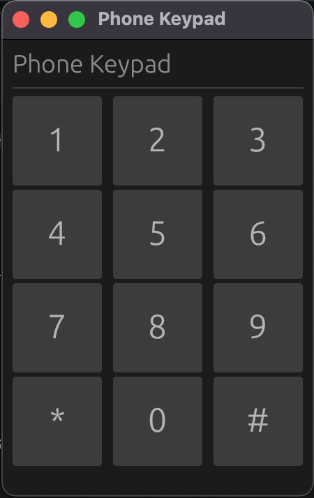

# Sound Synthesis

Just a very basic proof of concept demo of Egui & TinyAudio.

**NB:** I'm just dabbling with this project when I get bored, so the direction is TBD.

## Current Screenshot

## History

- 08/03/2024 - (6d5d0c6) launch with square/sine/triangle wave tones in the mixer
- 08/16/2024 - (a9ba340) plays DTMF touch-tones from a telephone keypad

